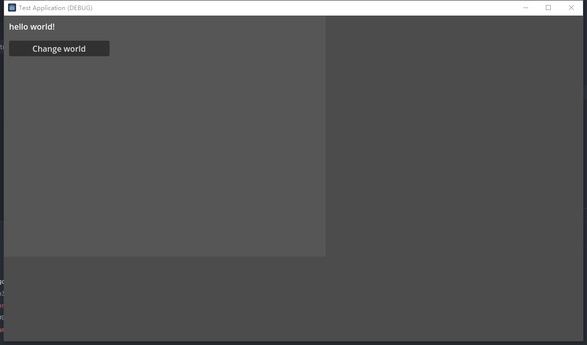

# Godot UI Markup Language
[](https://github.com/molingyu/guml/releases/latest) [](https://github.com/molingyu/guml/blob/main/LICENSE)


GUML is used to quickly create responsive Godot UI, supporting creation from text at runtime. Designed specifically for MOD systems.

## Feature
- QML-like syntax
- Support responsive binding of data to GUI
- Full Godot UI component support
- Support for theme overrides

## Install

use nuget:
```
dotnet add package GUML --version 0.0.4
```

## Document
- [Quick Start](Doc/quick_start.md)
- [GUML Syntax](Doc/guml_syntax.md)

## Example

`main.guml`:
```guml
Panel {
    size: vec2(640, 480),
    theme_overrides: { 
        panel: style_box_flat({
            bg_color: color(0.4, 0.4, 0.4, 0.4)
        })
    },
    Label {
        position: vec2(10, 10),
        size: vec2(200, 30),
        // $controller.SayHello binding to Label.text.If SayHello changes, text will also change.
        text:= "hello " + $controller.SayHello
    }
    
    Button {
        position: vec2(10, 50),
        size: vec2(200, 30),
        text: "Change world",
        #pressed: "ChangeHelloBtnPressed"
    }
}
```
`MainController.cs`:
```c#
public class MainController : GuiController
{
    public string SayHello {
	    get => _sayHello;
		set
		{
			_sayHello = value;
			OnPropertyChanged();
		}
    }
	
    private string _sayHello = "world!";

	public void ChangeHelloBtnPressed()
	{
		SayHello = "new world!";
	}
}
```


After clicking the *change world* button, the text will change to `hello new world!`